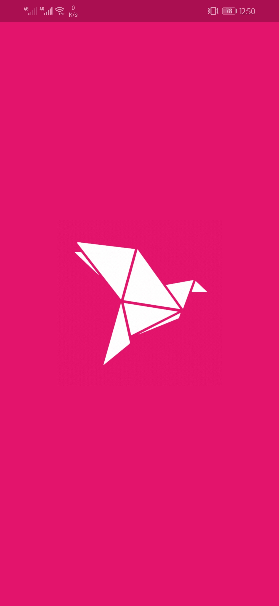
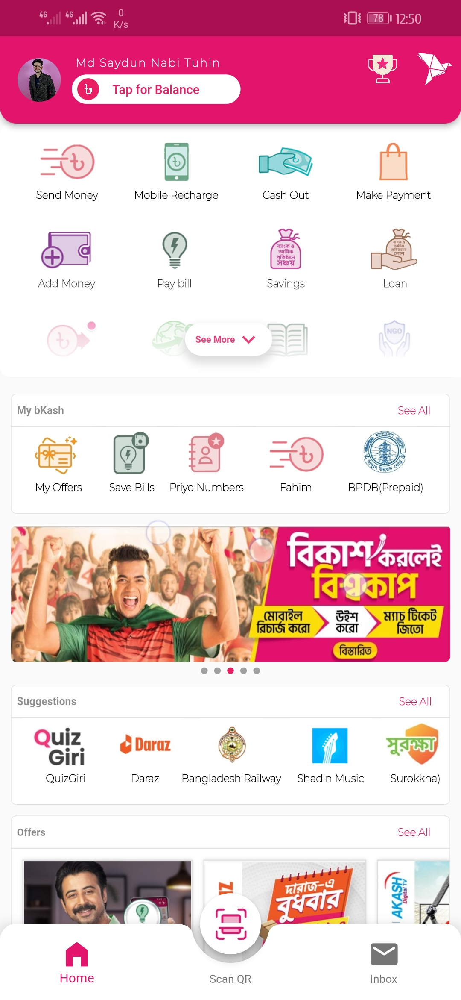
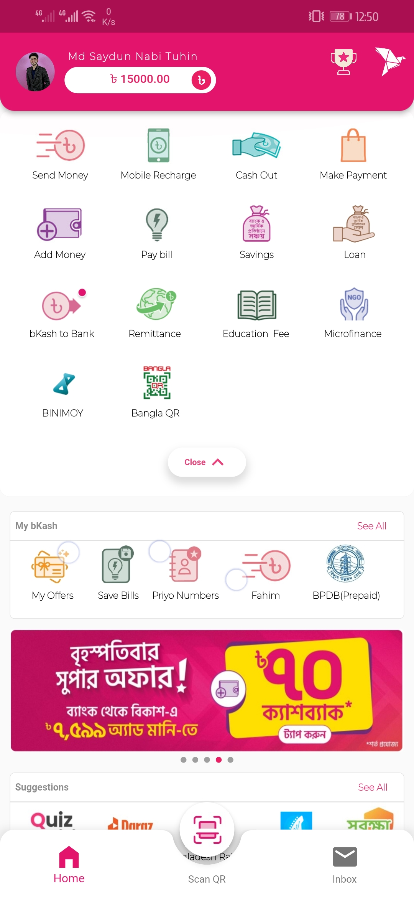
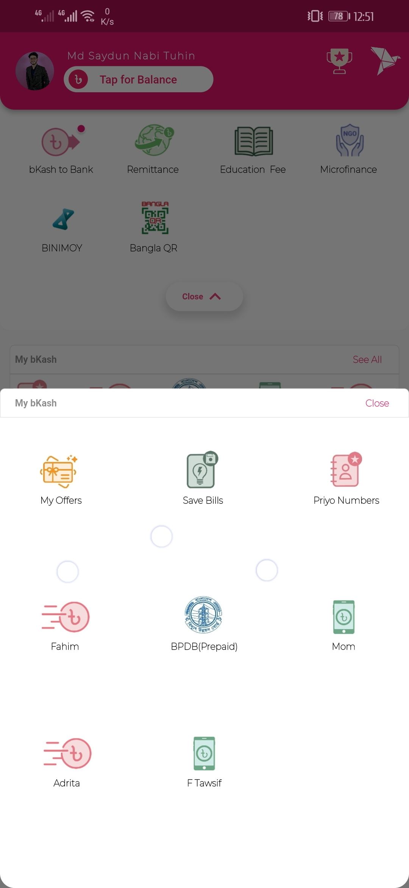
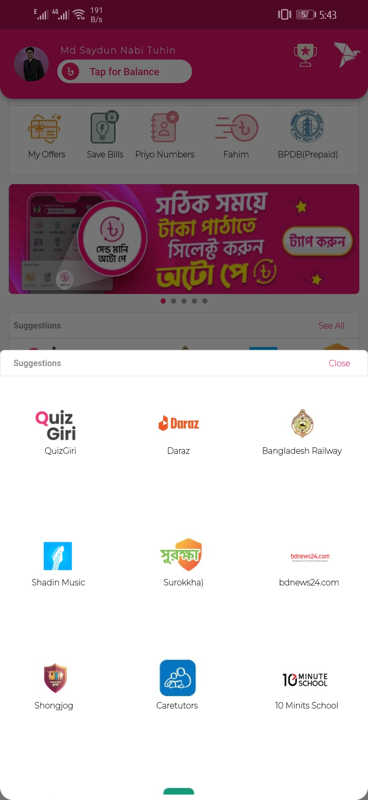
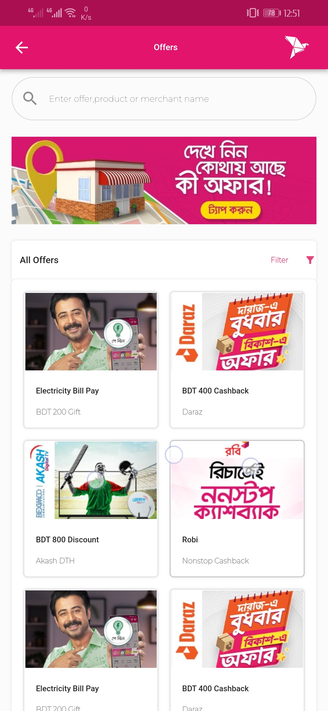
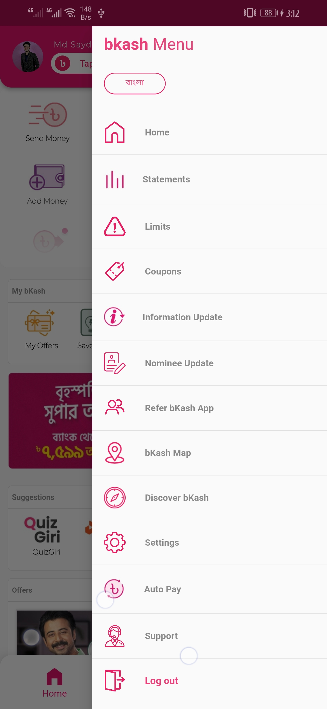
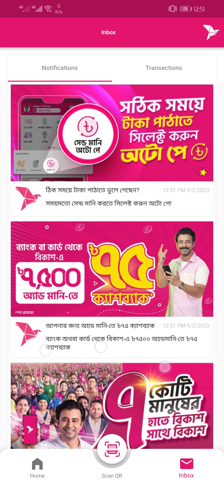
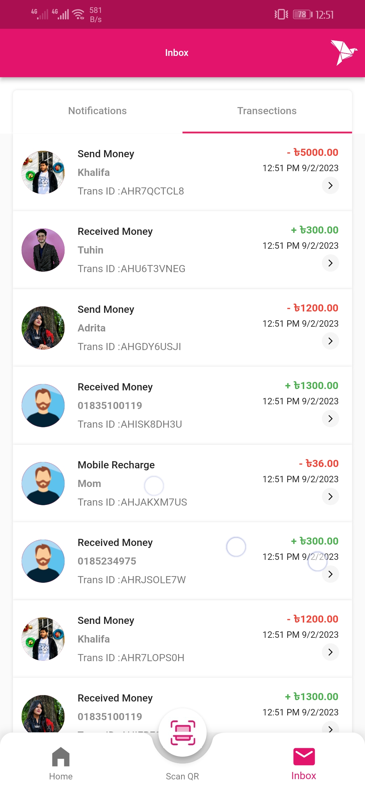
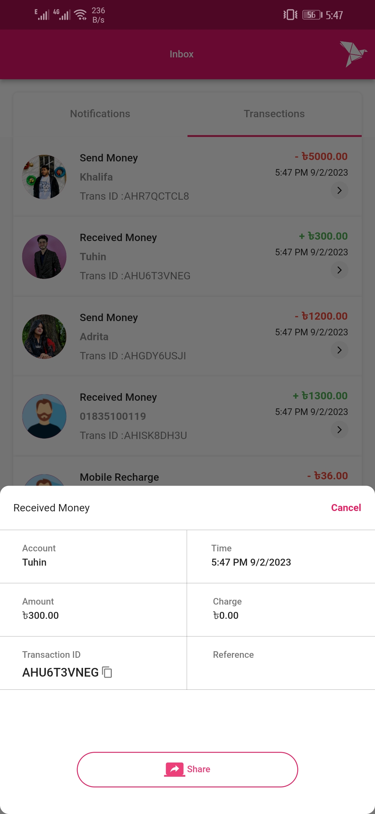

# bKash UI Clone

## Overview

This Flutter project is a faithful UI clone of bKash, a renowned financial software widely used in Bangladesh. The aim of this project is to replicate the user interface of bKash for educational purposes and as part of my portfolio. It showcases my skills in UI design and mobile app development using Flutter.

## Table of Contents

- [Demo](#demo)
- [Features](#features)
- [Getting Started](#getting-started)
  - [Prerequisites](#prerequisites)
  - [Installation](#installation)
- [Usage](#usage)
- [Screenshots](#screenshots)
- [Folder Structure](#folder-structure)
- [Contributing](#contributing)
- [License](#license)
- [Acknowledgments](#acknowledgments)

## Features

- **Custom UI Elements**: Recreated bKash's user interface with attention to detail.
- **Asset Challenges**: Overcame difficulties in finding suitable assets, utilizing open-source resources, and creating custom assets.
- **Drawer and Navigation Bar Customization**: Customized the app's drawer and navigation bar to match bKash's layout.
- **Custom Button Animation**: Implemented complex animations for custom buttons, ensuring a smooth user experience.
- **Balance Display**: Created a visually appealing animation to display the user's balance.

## Final Output
|  |  |  |  |  | 
|:----------------------:|:----------------------:|:----------------------:|:----------------------:|:----------------------:|

|  |  |  |  |  | 
|:----------------------:|:----------------------:|:----------------------:|:----------------------:|:----------------------:|

## Demo

[Watch Full Demo on YouTube]()

